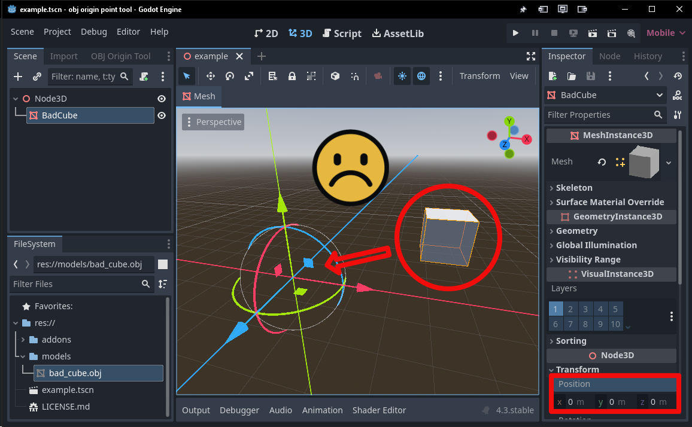
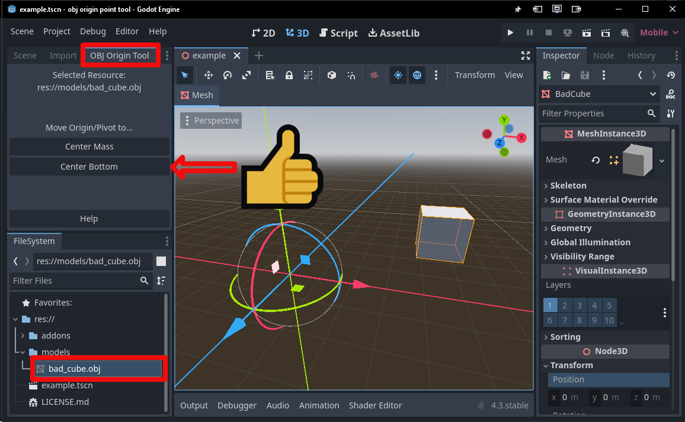
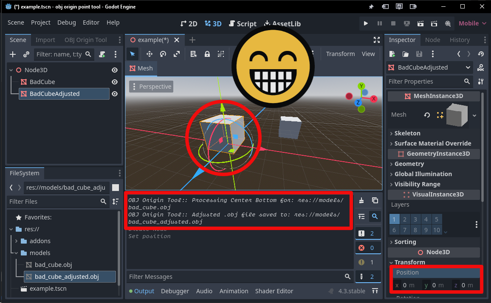

# OBJ Origin/Pivot Tool

A Godot 4 plugin that lets you correct the origin/pivot point of a .obj file inside of the Godot Editor.

---

## Features

- **Adjust .obj File Origin Point Easily:** One click correction of the origin point of a .obj file to place the origin either center mass or center bottom of the mesh

---

## Installation

1. **Download or Clone** this repository:
   ```bash
   https://github.com/RedPlanetGames/Godot-OBJ-Origin-Tool.git
   ```
2. Copy the `addons/obj_origin_tool` folder into your Godot project directory.
3. Open your project in Godot.
4. Go to **Project > Project Settings > Plugins**.
5. Enable the `OBJ Origin/Pivot Tool` plugin.

---

## Usage

1. **Select an OBJ Model:** Choose the OBJ model whose origin you want to adjust
2. **Use the Dock or Project -> Tools menu:** The tool will appear as a dock tab in the same panel as the Scene and Import tabs.  It also can be found in Project -> Tools
3. **Apply:** Select which origin point you want for your model

### Visual Example

#### 1. Problem: Bad Origin


#### 2. Solution: Adjust the Origin


#### 3. Result: Correct Origin


---

## License

This project is licensed under the MIT License. See [LICENSE.md](LICENSE.md) for more details.

---

## Contact

For updates and inquiries, connect with me on Bluesky:

[](https://bsky.app/profile/did:plc:3ck6hpykx43wau7rha7fjsmj)
---

## Acknowledgments

- **Godot Engine** for being awesome.

